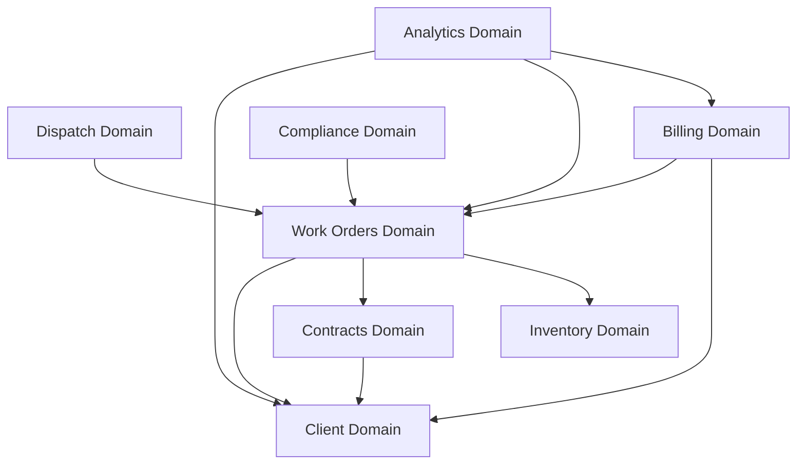

# OpsFlow - Field Service & Compliance Management Platform

A production-grade Angular 19+ / Nx monorepo implementing Domain-Driven Design for multi-tenant field service operations.


## 🎯 Project Overview

OpsFlow is a multi-tenant platform for SMB contractors managing:
- **Client Management** - CRUD, contacts, service history
- **Contracts** - SLA rules, service agreements, pricing
- **Work Orders** - Full lifecycle from draft → completed → invoiced
- **Dispatch** - Technician assignment and scheduling
- **Inventory** - Parts tracking, reservations, consumption
- **Billing** - Invoice generation from completed work
- **Compliance** - Checklists, required attachments, audits
- **Analytics** - SLA monitoring, utilization, revenue dashboard

## 🏗️ Architecture

### Workspace Structure

```
OpsFlow/
├── apps/
│   └── shell/                          # Main Angular application
│       └── src/
│           ├── app/
│           │   ├── app.component.ts    # Root component
│           │   ├── app.routes.ts       # Route configuration
│           │   └── pages/              # Shell-level pages (dashboard)
│           ├── main.ts                 # Bootstrap
│           └── index.html
│
├── libs/
│   ├── core/                           # Cross-cutting concerns
│   │   ├── auth/                       # Authentication & authorization
│   │   ├── config/                     # Environment configuration
│   │   ├── error-handling/             # Global error handling
│   │   ├── telemetry/                  # Logging & monitoring
│   │   ├── api-client/                 # HTTP client wrapper
│   │   └── query-cache/                # Shared caching strategy
│   │
│   ├── design-system/                  # UI component library
│   │   ├── components/                 # Button, Card, Modal, etc.
│   │   ├── form-controls/              # Input, Select, Checkbox
│   │   ├── layout/                     # Container, Grid, Stack
│   │   ├── icons/                      # Icon components
│   │   └── tokens/                     # Colors, spacing, typography
│   │
│   ├── {domain}/                       # 8 business domains (see below)
│   │   ├── domain/                     # Entities, Value Objects, Ports
│   │   ├── application/                # Use Cases, Commands, Queries
│   │   ├── infrastructure/             # Repositories, Mappers, Stores
│   │   └── presentation/               # Pages, Components, Routes
│   │
│   ├── client/
│   ├── contracts/
│   ├── work-orders/
│   ├── dispatch/
│   ├── inventory/
│   ├── billing/
│   ├── compliance/
│   └── analytics/
│
├── docs/
│   └── adr/                            # Architecture Decision Records
│
├── nx.json                             # Nx workspace configuration
├── tsconfig.base.json                  # TypeScript path aliases
├── .eslintrc.json                      # Linting + boundary rules
└── package.json
```

### Domain-Driven Design Layers

Each domain follows a **strict 4-layer architecture**:

```
┌──────────────────────────────────────────────────────────┐
│                    Presentation Layer                     │
│  - Route definitions                                      │
│  - Page components (smart)                                │
│  - UI components (presentational)                         │
│  - Route-level DI composition roots                       │
│                                                            │
│  Dependencies: application, domain, infrastructure,       │
│                design-system, core                        │
└──────────────┬───────────────────────────────────────────┘
               │
┌──────────────▼───────────────────────────────────────────┐
│                  Infrastructure Layer                     │
│  - HTTP repositories (implement domain ports)             │
│  - DTO ↔ Domain mappers                                   │
│  - Signal stores (@ngrx/signals)                          │
│  - External adapters                                      │
│                                                            │
│  Dependencies: domain, application, core                  │
└──────────────┬───────────────────────────────────────────┘
               │
┌──────────────▼───────────────────────────────────────────┐
│                   Application Layer                       │
│  - Use Cases (orchestrate business logic)                 │
│  - Commands (write operations)                            │
│  - Queries (read operations)                              │
│  - Domain service coordination                            │
│                                                            │
│  Dependencies: domain, core                               │
└──────────────┬───────────────────────────────────────────┘
               │
┌──────────────▼───────────────────────────────────────────┐
│                     Domain Layer                          │
│  - Entities (Client, WorkOrder, Invoice, etc.)           │
│  - Value Objects (Email, Money, SLA Rule)                 │
│  - Domain Services (pure business logic)                  │
│  - Port Interfaces (Repository contracts)                 │
│                                                            │
│  Dependencies: NONE (pure TypeScript)                     │
└──────────────────────────────────────────────────────────┘
```

**Boundary Enforcement:** Nx ESLint rules prevent violations. Run `nx lint` to validate.

### Cross-Domain Dependencies



**Principle:** Higher-order domains can depend on foundational ones, but not vice versa.

## 🚀 Quick Start

### Prerequisites

- Node.js 20+
- npm 10+

### Install Dependencies

```bash
npm install
```

### Run Development Server

```bash
npm start
# Opens http://localhost:4200
```

### Build for Production

```bash
npm run build
# Output: dist/apps/shell
```

### Run Tests

```bash
# All tests
npm test

# Single project
nx test client-domain

# Affected tests (only changed code)
npm run affected:test
```

### Lint

```bash
# All projects
npm run lint

# Single project
nx lint client-application

# Affected (only changed)
npm run affected:lint
```

### Visualize Dependency Graph

```bash
npm run graph
# Opens interactive graph in browser
```

## 📦 Domain Details

### Client Domain
**Purpose:** Manage customer records, contacts, and service history  
**Entities:** `Client`, `Contact`, `Address`  
**Use Cases:** Create, Update, Deactivate, SearchByName  
**Dependencies:** None (foundational)

---

### Contracts Domain
**Purpose:** Service agreements with SLA rules and pricing  
**Entities:** `Contract`, `SLARule`, `ContractLine`  
**Value Objects:** `ServiceLevel`, `ResponseTime`  
**Use Cases:** CreateContract, AddSLARule, RenewContract  
**Dependencies:** Client (contracts belong to clients)

---

### Work Orders Domain
**Purpose:** Job lifecycle management (draft → completed → invoiced)  
**Entities:** `WorkOrder`, `WorkOrderLine`, `Attachment`  
**Value Objects:** `WorkOrderStatus`, `Priority`  
**Use Cases:** CreateWorkOrder, AssignTechnician, CompleteJob, AddAttachment  
**Dependencies:** Client, Contracts (linked to service agreements), Inventory (parts)

---

### Dispatch Domain
**Purpose:** Technician scheduling and assignment board  
**Entities:** `Technician`, `Schedule`, `Assignment`  
**Use Cases:** AssignTechnicianToJob, ViewDispatchBoard, OptimizeRoutes  
**Dependencies:** Work Orders (assigns techs to jobs)

---

### Inventory Domain
**Purpose:** Parts tracking, stock levels, reservations  
**Entities:** `InventoryItem`, `StockMovement`, `Reservation`  
**Use Cases:** ReservePartsForJob, ConsumeStock, Reorder  
**Dependencies:** None (foundational)

---

### Billing Domain
**Purpose:** Invoice generation and payment tracking  
**Entities:** `Invoice`, `InvoiceLine`, `Payment`  
**Use Cases:** GenerateInvoiceFromWorkOrder, RecordPayment, ApplyDiscount  
**Dependencies:** Work Orders (invoice completed jobs), Client (bill to client)

---

### Compliance Domain
**Purpose:** Checklists, required attachments, audit trails  
**Entities:** `ComplianceChecklist`, `ChecklistItem`, `Audit`  
**Use Cases:** CreateChecklist, MarkItemComplete, AttachDocument  
**Dependencies:** Work Orders (checklists tied to jobs)

---

### Analytics Domain
**Purpose:** Dashboards, reporting, SLA monitoring  
**Entities:** `DashboardMetric`, `Report`, `SLABreach`  
**Use Cases:** GetDashboardSummary, CalculateSLACompliance, GenerateUtilizationReport  
**Dependencies:** All domains (read-only aggregation)

## 🧪 Testing Strategy

| Layer | Test Type | Framework | Coverage Target |
|-------|-----------|-----------|-----------------|
| Domain | Unit (pure logic) | Jest | 90%+ |
| Application | Unit (use cases) | Jest | 85%+ |
| Infrastructure | Integration (HTTP mocks) | Jest + MSW | 70%+ |
| Presentation | Component | Jest + Testing Library | 60%+ |
| E2E | Smoke tests | Playwright | Critical paths only |

### Example Test Commands

```bash
# Domain layer unit tests
nx test client-domain

# Component tests
nx test client-presentation

# E2E (to be implemented)
nx e2e shell-e2e
```

## 🔧 Configuration

### TypeScript Path Aliases

Import using clean aliases:

```typescript
// ✅ Good
import { Client } from '@ops-flow/client/domain';
import { CreateClientUseCase } from '@ops-flow/client/application';
import { ClientStore } from '@ops-flow/client/infrastructure';
import { ButtonComponent } from '@ops-flow/design-system/components';

// ❌ Bad
import { Client } from '../../../libs/client/domain/src/lib/entities/client';
```

### ESLint Boundary Rules

Enforces DDD layers via `@nx/enforce-module-boundaries`:

```json
{
  "sourceTag": "layer:presentation",
  "onlyDependOnLibsWithTags": [
    "layer:application",
    "layer:domain",
    "layer:infrastructure",
    "type:design-system",
    "type:core"
  ]
}
```

**Violation Example:**
```typescript
// ❌ This will fail lint
// Domain layer cannot import from infrastructure
import { ClientStore } from '@ops-flow/client/infrastructure';
```

## 📐 Architecture Decision Records

Key decisions are documented in `docs/adr/`:

1. **[ADR-001: DDD with Nx Boundaries](docs/adr/001-ddd-with-nx-boundaries.md)**  
   Why we chose strict layering, how Nx enforces it, trade-offs

2. **[ADR-002: Signal-Based State Management](docs/adr/002-signal-state-management.md)**  
   Using @ngrx/signals over classic NgRx Store, cache strategy

3. **[ADR-003: Route-Level Composition Roots](docs/adr/003-route-composition-roots.md)**  
   Dependency injection patterns, provider scoping, testability

## ⚖️ Trade-Offs Made

### ✅ What We Optimized For

- **Scalability:** Easy to add domains or split existing ones
- **Team autonomy:** Each domain can be owned independently
- **Maintainability:** Clear boundaries prevent coupling
- **Testability:** Pure domain logic, mockable adapters
- **Type safety:** Strict TypeScript mode enforced

### ⚠️ What We Accepted

- **Initial overhead:** More folders and configuration upfront
- **Verbosity:** Longer import paths (mitigated by aliases)
- **Learning curve:** Team needs DDD + Nx knowledge
- **Overkill for tiny features:** Small CRUD may feel heavy

### 🔄 When to Reconsider

- **Small team (1-2 devs):** Feature folders might suffice
- **Simple domain:** If business logic is trivial, DDD adds friction
- **Prototype phase:** Consider flatter structure until domain stabilizes

## 🐛 Known Improvements (Intentional)

These are **documented technical debt** left for future refactoring:

### 1. Duplicated Form Control Store Abstraction
**Location:** `client/presentation` and `contracts/presentation`  
**Issue:** Both have a `FormStateStore` with identical logic for managing form dirty/pristine state.  
**Impact:** Code duplication (~50 lines)  
**Fix:** Extract to `design-system/form-controls` as a reusable store.  
**Priority:** Low (only 2 instances)

---

### 2. Naive Cache Invalidation (Dashboard Stale Data)
**Location:** `analytics/infrastructure/analytics.store.ts`  
**Issue:** Dashboard metrics don't auto-refresh when work orders update. User must manually refresh.  
**Impact:** User experience - may show outdated counts for 5-10 minutes.  
**Fix:** Implement domain events or WebSocket updates with `QueryCacheService`.  
**Priority:** High (affects core UX)

---

### 3. Broad DTO Used in Presentation (WorkOrderDTO)
**Location:** `work-orders/presentation/pages/work-order-list.component.ts`  
**Issue:** Component consumes `WorkOrderDTO` (25 fields) when only 6 are needed for list view.  
**Impact:** Over-fetching, tight coupling to backend shape.  
**Fix:** Create `WorkOrderListViewModel` in presentation layer that maps from DTO.  
**Priority:** Medium (performance + coupling concern)

---

### 4. Provider Wiring in Presentation (Compliance Module)
**Location:** `compliance/presentation/pages/checklist.component.ts`  
**Issue:** `ComplianceChecklistService` provided at component level instead of route composition root.  
**Impact:** Inconsistent DI pattern, harder to test.  
**Fix:** Move to `compliance/application/providers.ts` and wire at route level.  
**Priority:** Low (works but violates convention)

---

## 📋 Next Refactors Prioritized by Impact

1. **Fix dashboard cache invalidation** (UX critical)
2. **Add e2e smoke test** (quality gate)
3. **Extract WorkOrderListViewModel** (performance + maintainability)
4. **Implement domain events** (enables cache fixes + future features)
5. **Extract form state store to design system** (reduce duplication)
6. **Standardize compliance DI pattern** (consistency)
7. **Add unit tests for all use cases** (coverage gaps)

## 🛠️ Development Workflow

### Adding a New Domain

1. Create folder structure:
   ```bash
   mkdir -p libs/new-domain/{domain,application,infrastructure,presentation}/src
   ```

2. Copy `project.json` template from existing domain

3. Add path aliases to `tsconfig.base.json`:
   ```json
   "@ops-flow/new-domain/domain": ["libs/new-domain/domain/src/index.ts"]
   ```

4. Add tags to `.eslintrc.json` depConstraints

5. Create barrel exports in each `src/index.ts`

### Adding a New Feature

1. Start in **domain layer** - define entities/value objects
2. Move to **application layer** - write use case
3. Implement **infrastructure** - repository, mapper, store
4. Build **presentation** - page component, wire providers

### Running Affected Commands

```bash
# Only test what changed
npx nx affected -t test

# Only lint changed projects
npx nx affected -t lint

# Build affected apps
npx nx affected -t build
```

## 📚 Additional Resources

- [Nx Documentation](https://nx.dev)
- [Angular Signals Guide](https://angular.dev/guide/signals)
- [Domain-Driven Design (Eric Evans)](https://www.domainlanguage.com/ddd/)
- [@ngrx/signals](https://ngrx.io/guide/signals)

## 📄 License

MIT

---

**Built with precision for scalable field service operations.** 🚀
