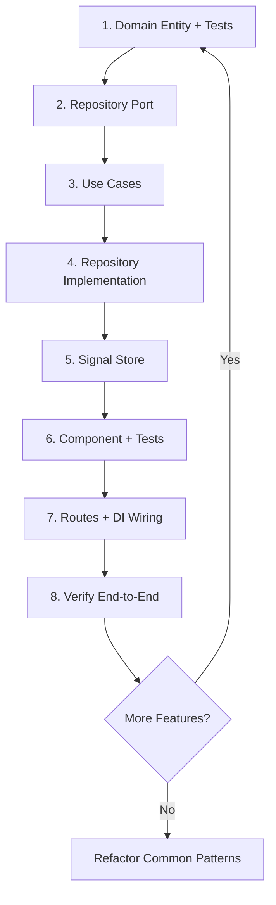

# ADR-005: Vertical Slice Implementation Strategy

**Status:** Accepted
**Date:** 2026-03-26
**Deciders:** Architecture Team

## Context

When implementing new features in OpsFlow, developers face a choice between:

1. **Horizontal Slicing:** Build one layer completely across all features (e.g., all domain entities first)
2. **Vertical Slicing:** Build one feature end-to-end through all layers (domain → application → infrastructure → presentation)

The Work Orders feature required implementing multiple layers (domain entities, use cases, repositories, stores, UI) with dependencies between them. The implementation order affects:

- Time to first working feature
- Ability to test incrementally
- Parallelization of work
- Feedback loops
- Risk of integration issues

## Decision

We will use **Vertical Slice Architecture** to implement features end-to-end through all layers before moving to the next feature.

### Implementation Approach

For Work Orders, we implemented in this order:

```
1. Domain Layer (Pure TypeScript)
   ├── WorkOrderStatus enum
   ├── WorkOrder entity with business rules
   ├── WorkOrderRepository port (abstract class)
   └── Domain invariant tests

2. Application Layer (Use Cases)
   ├── CreateWorkOrderUseCase
   ├── GetWorkOrderUseCase
   ├── ListWorkOrdersUseCase
   ├── UpdateWorkOrderStatusUseCase
   └── Provider functions

3. Infrastructure Layer (Adapters)
   ├── WorkOrderMapper (DTO ↔ Entity)
   ├── WorkOrderHttpRepository (implements port)
   ├── WorkOrderStore (Signal store with @ngrx/signals)
   └── Provider functions

4. Presentation Layer (UI)
   ├── WorkOrderListComponent
   ├── Component template & styles
   ├── Routes with DI configuration
   └── Component behavior tests

5. Integration
   ├── Update export barrels (index.ts)
   ├── Wire up providers in routes
   └── Verify end-to-end functionality
```

### Key Principles

1. **Bottom-Up Implementation:** Start with domain (no dependencies), build outward
2. **Test as You Go:** Each layer tested before moving to next
3. **Incremental Integration:** Wire up layers progressively
4. **Single Responsibility:** Each layer focused on its concern
5. **Dependency Inversion:** Outer layers depend on inner layer ports

## Consequences

### Positive

✅ **Rapid Feedback:** Working feature visible early (even with mocked data)
✅ **Reduced Integration Risk:** Problems discovered incrementally, not at the end
✅ **Better Testing:** Each layer testable independently as it's built
✅ **Clearer Progress:** Feature completion is obvious (works end-to-end)
✅ **Easier Parallelization:** Different features can be built by different developers
✅ **Focused Context:** Developer stays in one feature domain at a time
✅ **Earlier Value Delivery:** Can ship feature once slice is complete

### Negative

❌ **Code Duplication Risk:** Shared patterns not obvious until multiple slices exist
❌ **Inconsistency Risk:** Each slice might reinvent patterns differently
❌ **Refactoring Overhead:** Extracting common code requires touching multiple slices
❌ **Repository Churn:** More files changed per PR (all layers touched)

### Neutral

⚠️ **Slice Granularity:** Deciding what constitutes "one slice" requires judgment
⚠️ **Cross-Cutting Concerns:** Authentication, logging span multiple slices
⚠️ **Shared Components:** UI patterns emerge after implementation, not before

## Trade-offs

| Aspect | Horizontal Slicing | Vertical Slicing | Rationale |
|--------|-------------------|------------------|-----------|
| Time to Working Feature | Slow (all layers needed) | Fast (one feature done) | Business value delivered sooner |
| Code Reuse | Obvious early | Discovered later | Acceptable trade-off for reduced risk |
| Testing | Mocked until end | Real at each step | Catches integration issues early |
| Team Coordination | Each team owns a layer | Each team owns features | Better for DDD bounded contexts |
| Merge Conflicts | Fewer (same files) | More (many files) | Mitigated by good branching strategy |

## Risks

1. **Pattern Divergence:** Different slices implement similar things differently
   *Mitigation:* Code review, reference implementation (Client domain), architecture guidelines

2. **Missed Abstractions:** Shared logic duplicated across slices
   *Mitigation:* Regular refactoring sprints, "rule of three" before abstracting

3. **Incomplete Features:** Pressure to ship partial slices
   *Mitigation:* Define "done" as end-to-end tested and integrated

4. **Over-Engineering:** Building infrastructure not yet needed
   *Mitigation:* YAGNI principle, build only what current slice requires

## Implementation Flow

### Step-by-Step Process



### Reference Implementation

The **Client domain** (`libs/client/*`) serves as the reference implementation:
- Domain: `Client` entity with status transitions
- Application: `CreateClientUseCase`, `GetClientUseCase`, `ListClientsUseCase`
- Infrastructure: `ClientHttpRepository`, `ClientMapper`, `ClientStore`
- Presentation: `ClientListComponent`, routes with providers

New features should follow these established patterns.

## Sprint Deliverables (Work Orders)

Completed in this sprint:

✅ **Domain Layer:**
- WorkOrder entity with 5 status states and transition guards
- WorkOrderRepository port
- 14 unit tests covering all invariants

✅ **Application Layer:**
- 4 use cases (Create, Get, List, UpdateStatus)
- Provider function for DI

✅ **Infrastructure Layer:**
- WorkOrderMapper for DTO conversion
- WorkOrderHttpRepository implementing domain port
- WorkOrderStore with 4 computed signals and 7 methods

✅ **Presentation Layer:**
- WorkOrderListComponent with template and styles
- Routes with lazy loading and DI wiring
- 5 component behavior tests

✅ **Integration:**
- All export barrels updated
- Route-level dependency injection configured
- Type checking passes (no errors)

## Lessons Learned

### What Worked Well
- Starting with domain tests ensured business rules were correct
- Reference Client implementation provided clear patterns to follow
- Strict typing caught errors early (status enums, readonly properties)
- Component tests with mocked stores were fast and reliable

### Challenges
- Jest configuration required for domain tests (resolved with tsconfig.spec.json)
- Immutable entity pattern requires discipline (no property mutations)
- Store methods needed careful state replacement (not mutation)

### Future Improvements
- Create Nx generator for vertical slices (scaffold all layers)
- Extract mapper pattern into reusable utility
- Consider integration tests between layers (not just unit tests)

## Related Decisions

- **ADR-001:** DDD layer structure enables vertical slicing
- **ADR-002:** Signal stores provide reactive state at infrastructure layer
- **ADR-003:** Route composition roots wire up DI for each slice
- **ADR-004:** Domain invariants ensure entities are always valid

## References

- [Vertical Slice Architecture (Jimmy Bogard)](https://www.jimmybogard.com/vertical-slice-architecture/)
- [Feature Slices for ASP.NET Core MVC](https://docs.microsoft.com/en-us/archive/msdn-magazine/2016/september/asp-net-core-feature-slices-for-asp-net-core-mvc)
- [CQRS and Vertical Slices](https://enterprisecraftsmanship.com/posts/cqrs-vs-vertical-slices/)
